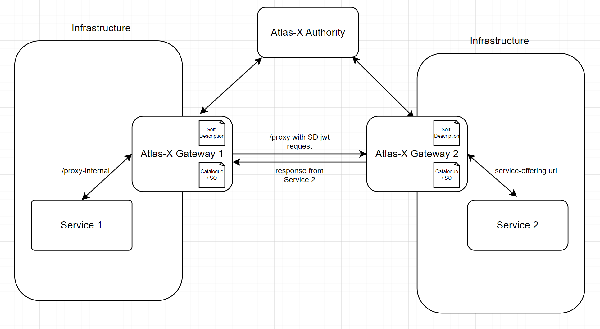

# AtlasX-Gateway

## Description

Atlas is a project to provide a wrapper to use within the Gaia-X context. 
AtlasX-Gateway developed based on the exemplar service found at https://gitlab.com/atlas-x, this project showcases the application of the Atlas-X library as a gateway. 

This documentation will only show what has been added on top of the Atlas-X example service. 
Refer to https://gitlab.com/atlas-x/example-service/-/blob/master/README.md for initial setup instructions and documentation.

## Introduction using Docker

For a quick start there is also an [Introduction using Docker](/docs/intro-docker.md)

## Instructions

Files to be modified to the intial setup:
```
ATLAS-X-GATEWAY/
│   pom.xml     
│   │
└───src/main/resources/
│   │   application.yml
|   |
│   |   └───vc-templates/
|   |   | GaiaxCredentialSD.json
```
* pom.xml
   * change the name of the docker image that could be generated in line 89 to what you want
```xml
                <configuration>
                    <from>
                        <image>amazoncorretto:21-alpine</image>
                    </from>
                    <to>
                        <!-- Change here for the image name -->
                        <image>roms-atlas-gateway-server</image>
```
* In application.yaml edit your service-offerings.services that are available in your ServiceOffering*.json files.
    ```yml
    # Service names should match the gx-service-offering:name field in the ServiceOffering*.json files as that is only how someone can figure what services you are offering 
    service-offerings:
      services:
        - name: ServiceOfferingExample
          url: http://localhost:3000
        - name: ServiceOfferingExample2
          url: http://example2.com
        - name: ServiceOfferingKubernetesExample
          url: http://my-service.my-namespace.svc.cluster.local
    ```
* Additional CustomPolicy instances can be added that check for Legal Registration Number and Role of a consumer. 
  The following configuration checks if the consumer that requests a service is from a company with 
  Legal Registration Number 0815 and has the role ADMIN:
  ```yml
  policies:
    custompolicy:
      admin_role_policy:
        legalRegistrationNumber: 0815
        roleToGrantAccess: ADMIN
  ```
  Policies and CustomPolicy instances and be added to a service route to check the credentials of incoming requests. 
  In the following example, a route for ServiceOfferingExample2 from above is created with the policy admin_role_policy  
  created above:
  ```yml
  routes:
    ExampleServiceOffering2:
      - admin_role_policy
  ```
  The admin_role_policy was configured above. But there are also default policies that can be used in routes without  
  configuration.
  The default policies are:
  
  | Name | Description                                                           |
  | ---- |-----------------------------------------------------------------------|
  | signatureVerificationPolicy | Verify signature of VC and VP. Containing VCs of VP are not verified. |
  | presentationCredentialsSignedPolicy | Checks if all presented credentials are signed.                       |
  | vcSchemaPolicy | Policy to check JSON-LD schema.                                       |
  | credentialRoleVerificationPolicy | Verify roles to be present (works with Gaia-X credentials only). |

  
  
*  Include an 'internal-api-key' parameter within the application.yaml file to facilitate the authentication process for the internal-proxy endpoint.
    ```yml
    internal-api-key: my-secret-key
    ```
* change also the config section:
  ```yml
   config:
  domain: any.internet                                              # change here to your domain
  signatory-key-alias: example-signatory
  service-base-address: https://any.internet                        # change here to corresponding base URL of the service endpoit
  self-sign-self-description: false
  vc-group: example
  auto-create-signatory-did: true
  autostart-self-description-schedule: true
  return-empty-self-description: true
  catalogue-refresh-rate: 10                                        # change here to a smaller value for easier testing
  self-description-refresh-rate: 10                                 # change here to a smaller value for easier testing
  ```  
* Modify the information towards your company in the GaiaxCredentialSD.json
   * these information must not met the gaia-x specifications yet! Currently no compliance check is made!

  
## Proxy Controller

### /proxy/{serviceName}/**

This controller, defined in `ProxyController.java`, clones the incoming request (including the body, HTTP method, headers, etc.) and sends it to the service provided in the path (serviceName).

The `/proxy` endpoint acts as a gateway for forwarding HTTP requests. It supports all types of HTTP methods (`GET`, `POST`, `PUT`, `DELETE`, etc.). The HTTP method of the incoming request is preserved when the request is forwarded.

Please note that the `/proxy` route requires an `Authorization` header generated by the Atlas-X library using the Self Description VC.

This endpoint is meant to be reached from outside. Use case is shown in the diagrams.

### /internal-proxy

This controller, also defined in `ProxyController.java`, it works almost the same with some differences. It doesnt require Authorization header because it is meant to be only used in local network. This endpoint is only reachable from services that are deployed within the same network. 

The `X-Service-Url` header is required and should contain the URL of the destination service. The idea is to use this endpoint to reach out to other Atlas-X instances via /proxy endpoint hence this header should be a `https://<atlas-x-url>/proxy/<ServiceName>/<ServicePath?>` for example.

The `X-Api-Key` header is required and should contain the internal-api-key defined in the application.yaml file. This is to ensure that only services within the same network can access this endpoint.

Again, it clones the incoming request plus it generates a JWT using your VC in your Atlas-X instance, adds it to the `Authorization` header, so you can be authenticated on the other Atlas-X instance, at /proxy endpoint.

## Use Case

### Integration of ServiceOfferingService2 into Service 1 example

1- Developer of Service 1 goes to the `https://<atlas-x-gateway-2-url>/gx/catalogue` or `https://<atlas-x-gateway-2-url>/gx/so` to find out the service offerings provided and it's swagger documentation. Decides to use ServiceOfferingService2.

2- The developer adds a function to use ServiceOfferingService2 in Service1 with url `https://<atlas-x-gateway-1-url>/internal-proxy` and with header `X-Service-Url`: `https://<atlas-x-gateway-2-url>/proxy/ServiceOfferingService2/<path>?<query>`.



## Troubleshooting
 currently you need to create a empty folder "hvk-example" in the root directory of this project. This folder is needed to store the VC and Vp signed by the [Atlas-X authority](https://authority.atlas.cartrust.com/index.html) [https://authority.atlas.cartrust.com/index.html]

## how to generate a docker image using VS Code
* check out the repo and open in in VS CODE
* install the following extensions:
   * [Extension Pack for Java](https://marketplace.visualstudio.com/items?itemName=vscjava.vscode-java-pack)
   * [Java](https://marketplace.visualstudio.com/items?itemName=Oracle.oracle-java)
   * [Maven for Java](https://marketplace.visualstudio.com/items?itemName=vscjava.vscode-maven)
*  to build the image got to the maven MAVEN at the bottom left and run the *dockerBuild* command
    * MAVEN
        * Plugins
            * jib
                * dockerBuild
* this will generate a docker image on you machine with the name defined in the **pom.xml** (see section above)
